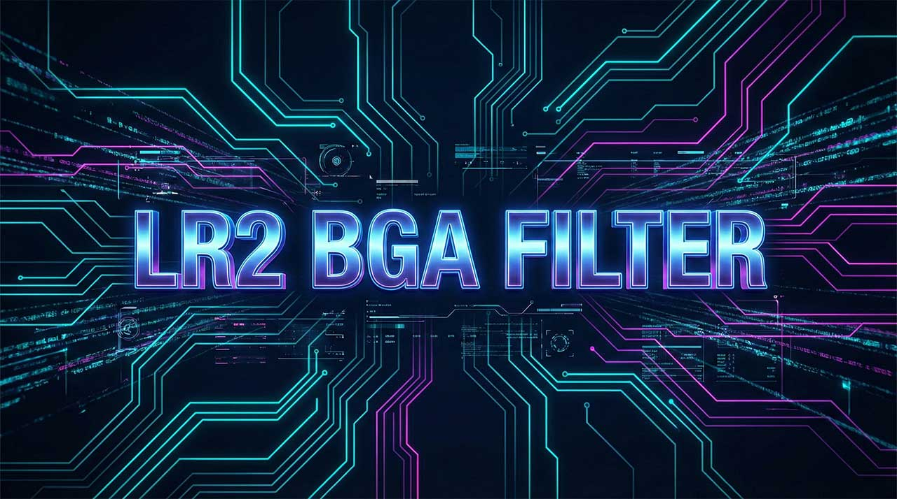

# LR2 BGA Filter

[](README.ja.md)
[](README.md)
[](README.ko.md)

LR2 (Lunatic Rave 2) 用の DirectShow フィルターです。BGA の再生品質とパフォーマンスを改善することを目的としています。



## 特徴

- **高解像度動画の適切な処理**: 適切なダウンスケーリングにより画質とパフォーマンスを両立します。
- **その他の機能**:
  - 黒帯 (レターボックス) の自動検出・除去
  - 外部ウィンドウでのBGA表示
  - 輝度調整
  - fps制限
  - 音声トラックの自動破棄
    - [無音トラック由来のトラブル](docs/ja/LR2_BGA_Stuttering_Investigation_and_Solutions.md)を回避できます

## 動作要件・設定 (重要)

本フィルターを正常に動作させるためには、**LAVFilters** の導入と、以下の特殊な設定が必要です。

1. **LAVFilters のインストール**
    - 本フィルターは LAVFilters(LAV Splitter, LAV Video Decoder) と組み合わせて使用することを前提としています。
    - [**LAV Filtersのダウンロード**](https://github.com/nevcairiel/lavfilters/releases) `LAVFilters-*.**-Installer.exe` をダウンロードしてください。
    - LAV Splitter (x86), LAV Video Decoder (x86) をインストールしてください。他は不要です。

2. **LAV Video Decoder の設定**
    - **主要なフォーマットの有効化**: ほぼ全ての Input Formats (H.264, HEVC, MPEG4等) を有効のままにしてください。デフォルトで有効になっているはずです。
    - **出力色空間の制限 (Output Formats)**: **RGB32 のみをチェックし、他をすべて外してください。**
        - *理由*: LR2 本体は RGB24 入力しか受け付けません。LAV の出力を RGB32 に限定することで、「LAV (RGB32) -> [本フィルター] -> LR2 (RGB24)」という経路を意図的に成立させ、本フィルターが強制的に使用されるようにします。

3. **メリット値 (優先度) の設定**
    - インストーラーにより本フィルター (`LR2BGAFilter`) は **最も高い優先度 (Merit Value)** に設定されます。
    - **2番目に LAV Video Decoder** が来るように設定されます。
    - *注意*: この順序を守らないと、OS標準の `quartz.dll` 等が優先されてしまい本フィルターが使用されない場合があります。

### 注意事項 (免責)

上記の設定（LAVの出力制限やメリット値の変更）は、32bit版のDirectShowを使用するシステム全体（他の動画プレイヤーなど）に影響を与える可能性があります。
DirectShow自体がレガシーな技術であり、現代の一般的な用途では影響は限定的と思われますが、ご了承の上で適用してください。

## 配布パッケージ構成

リリースパッケージは以下の構成となっています。

```text
/ (root)
├── LR2BGAFilter.ax   (フィルター本体)
├── Installer.exe     (インストール/アンインストール用)
├── LR2BGAFilterConfigurationTool.bat (設定画面起動用)
└── README.md         (本書)
```

## インストール方法

前述の通り、LAV Filtersの導入と設定が必要です。その後、以下の手順でインストールします。

1. [**Releases**](https://github.com/Neeted/lr2-bga-filter/releases) ページから最新の ZIP をダウンロードします。
2. 任意のフォルダに解凍します。`C:\Bin\LR2BGAFilter` など
3. `Installer.exe` を実行します。
    - Tips: コマンドラインから `.\Installer.exe /lang:ja` `.\Installer.exe /lang:en` `.\Installer.exe /lang:ko` でそれぞれ日本語、英語、韓国語表示にできます。引数なしの場合はOSの言語設定を優先します。
4. 前述の通り、LAVFiltersに関するレジストリ設定が変更されることに同意し、インストールを実行します。
5. インストールが完了したら、`LR2BGAFilterConfigurationTool.bat` を実行して設定を行います。

## 設定方法

詳しい設定方法は[**設定方法**](docs/ja/LR2BGAFilterConfigurationTool.md)を参照してください。

1. `LR2BGAFilterConfigurationTool.bat` を実行します。
2. 各種設定を行います。
3. `OK` ボタンを押して設定を保存します。

## アンインストール方法

1. `Installer.exe` を実行します。
2. インストール済みの場合は自動でアンインストールモードに切り替わります。
3. インストール時のバックアップを復元するか、ユーザー設定を削除するかを選択します。
4. ボタンを押してアンインストールを実行します。

## ライセンス

[MIT License](LICENSE)
