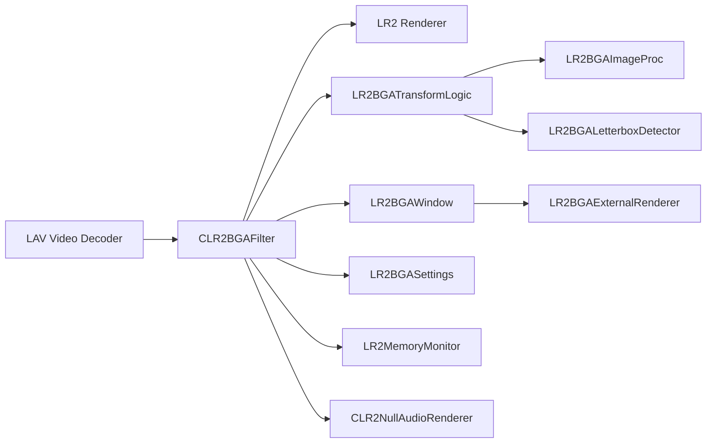
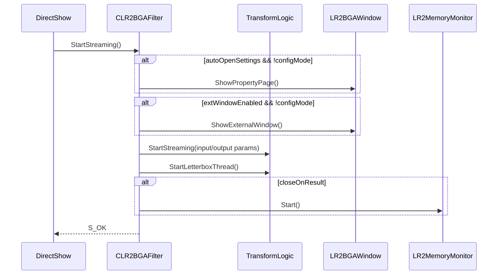
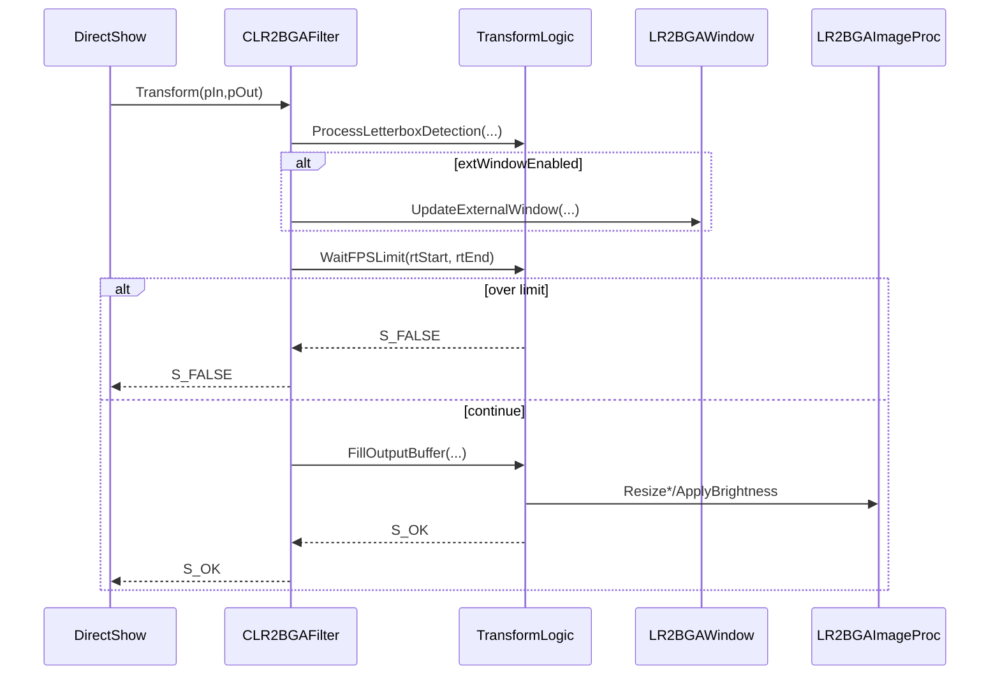
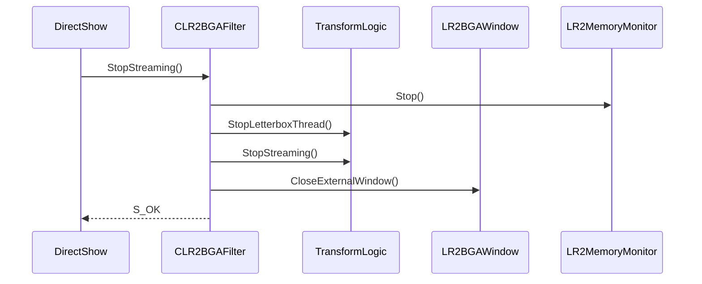

# LR2 BGA Filter 技術仕様書（開発者向け）

## 1. 文書情報
- 文書名: LR2 BGA Filter 技術仕様書
- 対象読者: 開発者、保守担当者、レビュー担当者
- バージョン: v1.0
- 最終更新日: 2026-02-13
- 対象リポジトリ: `lr2-bga-filter`
- 対象ブランチ/タグ: `main / v1.0.0`

## 2. 目的とスコープ
### 2.1 目的
- DirectShowフィルタとしての実装契約を明文化し、改修時の破壊的変更を防止する。
- 映像変換・設定反映・スレッド同期・外部表示の責務境界を明確化する。

### 2.2 スコープ
- 含む: `CLR2BGAFilter`, `LR2BGATransformLogic`, `LR2BGAImageProc`, `LR2BGAWindow`, `LR2BGASettings`, `LR2BGALetterboxDetector`, `LR2MemoryMonitor`, `CLR2NullAudioRenderer`。
- 含まない: インストーラー詳細、一般ユーザー向け手順書。

## 3. 前提・用語
### 3.1 動作前提
- OS: Windows
- DirectShow: 32bit系統を前提
- 前提フィルタ: LAV Splitter(x86), LAV Video Decoder(x86)
- 推奨経路: `LAV(RGB32) -> LR2BGAFilter -> LR2(RGB24)`

### 3.2 用語
- Passthrough: リサイズせず出力するモード（必要に応じてRGB32->RGB24変換は実施）
- Dummy: 1x1黒画像を1度送出し、以降スキップする軽量モード
- Letterbox: 映像上下の黒帯

## 4. システム概要
### 4.1 全体像
- 本システムは `CTransformFilter` 実装として入力映像を受け、RGB24へ変換して下流へ出力する。
- 変換処理の一部は `LR2BGATransformLogic` に委譲し、UI/描画は `LR2BGAWindow` 系に分離している。

### 4.2 コンポーネント図

## 5. 技術スタック
- 言語: C++
- API: Win32, COM, DirectShow BaseClasses, GDI, WinMM
- SIMD: SSE4.1 / AVX2（CPU検出で切替）
- 並列化: 独自ThreadPool (`LR2BGAThreadPool`)

## 6. モジュール構成
### 6.1 `CLR2BGAFilter`
- 役割: DirectShow接続交渉、Transform実行、設定I/F公開。
- 主要処理:
  - `CheckInputType`: Video + RGB24/RGB32 + VideoInfo/VideoInfo2のみ許可
  - `CheckTransform`: 出力はRGB24のみ許可
  - `StartStreaming`/`StopStreaming`: 変換ロジック、黒帯スレッド、外部ウィンドウ、メモリ監視を統括

### 6.2 `LR2BGATransformLogic`
- 役割: フレーム処理ロジック本体。
- 責務:
  - 黒帯検出要求と結果反映
  - FPS制限（S_FALSEによるフレームスキップ）
  - 出力バッファ構築（dummy/passthrough/resize）

### 6.3 `LR2BGAImageProc`
- 役割: リサイズと明るさ処理。
- 実装選択:
  - 既定: `CppOpt`
  - SSE4.1対応時: BilinearをSSE4.1へ
  - AVX2対応時: BilinearをAVX2へ

### 6.4 `LR2BGAWindow` / `LR2BGAExternalRenderer`
- 役割: 外部表示、デバッグ表示、プロパティページ、入力監視。
- 表示処理:
  - `UpdateFrame` で内部バッファ更新
  - `Paint` で `StretchDIBits` 描画
  - オーバーレイで外部表示輝度を実現

### 6.5 `LR2BGASettings`
- 役割: 設定の保持と `HKCU\Software\LR2BGAFilter` 永続化。
- スレッド安全: `std::recursive_mutex` で保護。

### 6.6 補助
- `LR2BGALetterboxDetector`: 黒帯判定 + ヒステリシス
- `LR2MemoryMonitor`: LR2プロセスメモリ監視（sceneId=5通知）
- `CLR2NullAudioRenderer`: 音声を即破棄、待機しないNull Renderer

## 7. データフロー仕様
### 7.1 Transformフロー
1. 入力サンプル取得 (`pIn`)
2. 入出力フォーマット解釈（StartStreamingで確定したキャッシュ値を使用）
3. 黒帯検出依頼（200ms間隔）
4. 外部ウィンドウ更新（有効時）
5. FPS制限判定（超過時 `S_FALSE`）
6. 出力生成（dummy/passthrough/resize）
7. LR2向け明るさ適用
8. タイムスタンプ・統計更新

### 7.2 モード分岐
- Dummy: 初回のみ黒画像出力、以降 `S_FALSE`
- Passthrough: リサイズなし、必要なら RGB32->RGB24
- Resize: ニアレスト or バイリニア

## 8. シーケンス仕様
### 8.1 StartStreaming

### 8.2 Transform

### 8.3 StopStreaming

## 9. メディアタイプ・接続契約
### 9.1 入力
- MajorType: `MEDIATYPE_Video`
- SubType: `MEDIASUBTYPE_RGB32` or `MEDIASUBTYPE_RGB24`
- FormatType: `FORMAT_VideoInfo` or `FORMAT_VideoInfo2`

### 9.2 出力
- MajorType: `MEDIATYPE_Video`
- SubType: `MEDIASUBTYPE_RGB24`
- FormatType: `FORMAT_VideoInfo`

### 9.3 ピン接続制約
- InputPin: 上流が同一 `CLSID_LR2BGAFilter` の場合拒否（多重挿入防止）
- OutputPin:
  - `OnlyOutputToLR2=true`: 実行プロセスパスに `body` を含まない場合拒否
  - `OnlyOutputToRenderer=true`: 接続先フィルタが出力ピンを持つ場合拒否

## 10. COMインターフェース仕様 (`ILR2BGAFilterSettings`)
### 10.1 設定API（主要）
| API | 値域/制約 | 永続化 | 備考 |
|---|---|---|---|
| `SetOutputSize` | width,height: 1..4096 | 即時Save | 無効値は `E_INVALIDARG` |
| `SetResizeAlgorithm` | `NEAREST`/`BILINEAR` | 即時Save | 無効値は `E_INVALIDARG` |
| `SetMaxFPS` | 1..60 | 即時Save | 無効値は `E_INVALIDARG` |
| `SetLimitFPS` | BOOL | 即時Save |  |
| `SetDummyMode` | BOOL | 即時Save | dummy送信状態リセット |
| `SetPassthroughMode` | BOOL | 即時Save |  |
| `SetExternalWindowEnabled` | BOOL | 即時Save | 状態に応じて即時表示/クローズ |
| `SetExternalWindowSize` | 1..4096 | 即時Save | 無効値は `E_INVALIDARG` |
| `SetBrightnessLR2` | 0..100 | 即時Save | 無効値は `E_INVALIDARG` |
| `SetBrightnessExt` | 0..100 | 即時Save | Overlay更新 |
| `SetGamepadID` | 0..15 | 即時Save | 監視スレッド再起動 |
| `SetGamepadButtonID` | 0..31 | 即時Save | 監視スレッド再起動 |
| `SetKeyboardKeyCode` | int | 即時Save | 監視スレッド再起動 |
| `SetAutoRemoveLetterbox` | BOOL | 即時Save | 検出状態リセット |
| `SetLetterboxThreshold` | int | 即時Save | detectorへ即時反映 |
| `SetLetterboxStability` | int | 即時Save | detectorへ即時反映 |
| `SetOnlyOutputToLR2` | BOOL | 即時Save | 接続制約 |
| `SetOnlyOutputToRenderer` | BOOL | 即時Save | 接続制約 |

### 10.2 プロパティページ
- `CLR2BGAFilterPropertyPage` が設定UIを担当。
- 一部項目（輝度）はスライダー操作で即時反映、その他は Apply で反映。

## 11. 設定仕様（レジストリ）
### 11.1 保存先
- `HKCU\Software\LR2BGAFilter`

### 11.2 主要キー
| Key | Type | Default | Range | 説明 |
|---|---|---:|---|---|
| OutputWidth | DWORD | 256 | 1..4096 | LR2出力幅 |
| OutputHeight | DWORD | 256 | 1..4096 | LR2出力高 |
| ResizeAlgo | DWORD | 1 | 0/1 | 0=Nearest,1=Bilinear |
| KeepAspectRatio | DWORD | 1 | 0/1 | LR2側アスペクト維持 |
| DummyMode | DWORD | 0 | 0/1 | ダミーモード |
| PassthroughMode | DWORD | 0 | 0/1 | パススルー |
| MaxFPS | DWORD | 60 | 1..60 | FPS上限 |
| LimitFPSEnabled | DWORD | 0 | 0/1 | FPS制限有効 |
| ExtWindowEnabled | DWORD | 1 | 0/1 | 外部ウィンドウ有効 |
| ExtWindowX/Y | DWORD | 0/0 | int | 外部ウィンドウ座標 |
| ExtWindowWidth/Height | DWORD | 512/512 | 1..4096 | 外部ウィンドウサイズ |
| ExtWindowAlgo | DWORD | 1 | 0/1 | 外部ウィンドウ補間 |
| ExtWindowKeepAspect | DWORD | 1 | 0/1 | 外部ウィンドウAR維持 |
| ExtWindowPassthrough | DWORD | 0 | 0/1 | 外部ウィンドウパススルー |
| ExtWindowTopmost | DWORD | 1 | 0/1 | 最前面 |
| BrightnessLR2 | DWORD | 100 | 0..100 | LR2明るさ |
| BrightnessExt | DWORD | 100 | 0..100 | 外部ウィンドウ明るさ |
| AutoOpenSettings | DWORD | 0 | 0/1 | 自動設定画面 |
| AutoRemoveLetterbox | DWORD | 1 | 0/1 | 黒帯除去有効 |
| LetterboxThreshold | DWORD | 22 | 0..255 | 黒判定閾値 |
| LetterboxStability | DWORD | 3 | 1..900(UI) | 安定化フレーム数 |
| CloseOnRightClick | DWORD | 1 | 0/1 | 右クリックで閉じる |
| CloseOnResult | DWORD | 0 | 0/1 | リザルトで閉じる |
| GamepadCloseEnabled | DWORD | 0 | 0/1 | ゲームパッド閉じる |
| GamepadID | DWORD | 0 | 0..15 | デバイスID |
| GamepadButtonID | DWORD | 0 | 0..31 | ボタンID |
| KeyboardCloseEnabled | DWORD | 0 | 0/1 | キーで閉じる |
| KeyboardKeyCode | DWORD | VK_RETURN | int | 仮想キーコード |
| OnlyOutputToLR2 | DWORD | 1 | 0/1 | LR2プロセス制限 |
| OnlyOutputToRenderer | DWORD | 1 | 0/1 | レンダラ制限 |
| DebugWindowX/Y | DWORD | CW_USEDEFAULT | int | デバッグ位置 |
| DebugWindowWidth/Height | DWORD | 450/1000 | int | デバッグサイズ |

### 11.3 反映タイミング
- 即時反映: 外部ウィンドウ表示/位置/Topmost、外部輝度、入力監視条件
- ストリーミング開始時ラッチ: 出力サイズ、パススルー判定、dummy判定

## 12. 黒帯検出仕様
### 12.1 方式
- ワーカースレッドで解析（イベント駆動）。
- 解析要求は約200ms間隔で送信。
- `LB_MODE_ORIGINAL`, `LB_MODE_16_9`, `LB_MODE_4_3` を判定。

### 12.2 判定要素
- 上下領域の黒率 (`IsRegionBlack`)
- コンテンツ領域暗転チェック (`IsContentAreaDark`)
- Rejection latch（非候補を恒常除外）
- ヒステリシス（連続一致で確定）

### 12.3 既定パラメータ
- 黒閾値: 22
- 安定化: 3フレーム
- 判定モード初期値: `LB_MODE_ORIGINAL`

## 13. パフォーマンス仕様
### 13.1 FPS制限
- `LimitFPSEnabled=true` かつ `MaxFPS>0` の場合適用。
- `minInterval = 10,000,000 / MaxFPS` (100ns単位)
- 間隔未満フレームは `S_FALSE` を返しドロップ。

### 13.2 画像処理最適化
- Nearest: CppOpt + ThreadPool
- Bilinear: AVX2 > SSE4.1 > CppOpt
- LUT (`m_lutXIndices`, `m_lutXWeights`) を再利用

### 13.3 収集統計
- `m_inputFrameCount`, `m_frameCount`, `m_processedFrameCount`
- `m_droppedFrames`
- `m_totalProcessTime`, `m_avgProcessTime`

## 14. スレッドモデル・同期仕様
### 14.1 スレッド
- DirectShow処理スレッド (`Transform`)
- Letterbox解析スレッド
- 外部ウィンドウスレッド
- デバッグウィンドウスレッド
- 入力監視スレッド
- プロパティページスレッド
- MemoryMonitor監視スレッド

### 14.2 ロック階層
- フィルタ側:
  1. `m_csReceive`
  2. `m_mtxLBControl`
  3. `m_mtxLBBuffer`
  4. `m_mtxLBMode`
- ウィンドウ側:
  1. `m_mtxInput`
  2. `m_mtxDebug`
  3. Renderer内部mutex

### 14.3 同期ポリシー
- ロック保持中に `SendMessage` 等のGUI同期呼び出しは避ける。
- バッファ共有は mutex で保護し、ロックスコープを最小化する。

## 15. 外部ウィンドウ・デバッグUI仕様
### 15.1 外部ウィンドウ
- `WS_POPUP` ベースで生成。
- オーバーレイは `WS_EX_LAYERED | WS_EX_TRANSPARENT` を使用。
- `ExtWindowTopmost` により `HWND_TOPMOST/HWND_BOTTOM` 制御。

### 15.2 クローズトリガー
- 右クリック (`CloseOnRightClick`)
- ゲームパッド (`joyGetPosEx`)
- キーボード (`GetAsyncKeyState`)
- リザルト遷移 (`CloseOnResult` + `sceneId==5`)

### 15.3 デバッグUI
- 表示: 入出力情報、グラフ情報、統計、黒帯判定詳細
- 操作: `Copy Info`, `Open Settings`
- `m_debugMode=true` の場合、DebugView (`OutputDebugString`) にも以下を出力する:
- 下流ピン情報（フィルタ名、CLSID、モジュールパス）
- `EnumMediaTypes` 列挙結果（件数、終了HRESULTを含む）
- `QueryAccept` プローブ結果（代表フォーマットの受理/拒否）
- 接続確定後の最終合意MediaType（`NegotiatedOutput`）

## 16. 例外・障害時動作
- 入力メディア型不一致: `VFW_E_TYPE_NOT_ACCEPTED`
- 設定値不正: `E_INVALIDARG`
- ストリーミング前提不成立（未接続/未初期化キャッシュ）: `E_UNEXPECTED`
- FPS制限ドロップ: `Transform` は `S_FALSE`
- 黒帯検出不能: `LB_MODE_ORIGINAL` 維持
- 非LR2プロセスでのメモリ監視: 無効化して継続

### 16.1 エラーコード運用方針
- `VFW_E_TYPE_NOT_ACCEPTED`: MediaType/Transform交渉不一致で使用する。
- `E_INVALIDARG`: セッターAPIへの範囲外入力で使用する。
- `E_UNEXPECTED`: StartStreamingで確定されるべき接続/キャッシュ前提が満たされない場合に使用する。
- `S_FALSE`: Transform継続不能ではなく「意図したスキップ」（FPS制限、dummy継続）で使用する。
- `E_FAIL`: 接続制約違反（Pin接続拒否など）で使用する。

### 16.2 互換性を壊さないための原則
- 既存設定の意味を変更しない。同一キーで意味変更が必要な場合は新キーを追加する。
- 既存APIの値域を狭めない。値域変更が必要なら新メソッドまたは互換変換を追加する。
- `S_FALSE` を返していた制御点を `E_*` に変更しない（再生パイプライン影響が大きいため）。

## 17. セキュリティ・安全性
- 接続制限（`OnlyOutputToLR2`, `OnlyOutputToRenderer`）を既定有効。
- メモリ監視は `body` プロセス判定後のみ開始。
- メモリアクセスは `SafeRead` でSEH保護。

## 18. ビルド・デバッグ
### 18.1 ビルド
1. `LR2BGAFilter.sln` をVisual Studioで開く
2. Win32構成でビルド

### 18.2 デバッグ観点
- グラフ接続先が想定通りか
- `Transform` のドロップ率
- 外部表示の同期・フォーカス挙動
- 黒帯判定の安定性

## 19. テスト観点
### 19.1 機能
- Dummy/Passthrough/Resizeの出力整合
- 外部ウィンドウの表示・位置・Topmost
- 設定保存/再読込

### 19.2 性能
- 高解像度素材でのCPU使用率
- AVX2/SSE4.1/CppOptの比較
- FPS制限時の安定性

### 19.3 回帰
- LR2以外プロセスでの接続拒否
- 無音/低品質音声トラック時のスタッタ回避
- 長時間再生時のスレッド健全性

### 19.4 受け入れ基準（最小）
- 入力が `RGB24/RGB32` の場合、出力MediaTypeは常に `RGB24` であること。
- `OnlyOutputToLR2=true` 時、プロセス名に `body` を含まない環境で接続拒否されること。
- `LimitFPSEnabled=true` かつ高fps入力時、`S_FALSE` によるドロップが発生し、クラッシュしないこと。
- `AutoRemoveLetterbox=true` 時、検出不能フレームでも出力が破綻せず `LB_MODE_ORIGINAL` で継続すること。
- `CloseOnResult=true` 時、sceneId=5検知で外部ウィンドウが閉じること。
- `DummyMode=true` 時、初回のみ黒フレームを出力し、以降は `S_FALSE` スキップで `Frame out` が増加しないこと。

### 19.5 性能予算（暫定）
- 目標は「LR2再生体験を阻害しないこと」を最優先とし、厳密fps固定より安定性を優先する。
- SIMD非対応環境でも機能要件を満たすこと（速度低下は許容）。
- FPS制限有効時に、無制限時よりドロップ率とCPU負荷のいずれかが改善すること。

## 20. 既知の制約・改善候補
### 20.1 制約
- x86 DirectShow依存
- レジストリ設定が32bit DirectShow系全体に影響しうる
- `LR2MemoryMonitor` は対象アドレス/命令列への依存が強い

### 20.2 改善候補
- `std::result_of` を `std::invoke_result` へ更新
- メモリ監視のフック依存軽減
- API/設定仕様の自動生成
- 単体テスト導入（変換ロジック/検出ロジック）

### 20.3 仕様変更ポリシー
- 仕様変更が必要: MediaType契約（入力許容/出力形式）を変更する場合
- 仕様変更が必要: 設定キーの意味・既定値・値域を変更する場合
- 仕様変更が必要: Pin接続制約の既定動作を変更する場合
- 実装差し替えで対応可能: SIMD実装の入れ替えや最適化
- 実装差し替えで対応可能: 内部バッファ構造の変更（外部契約を維持する場合）
- 実装差し替えで対応可能: デバッグ表示項目の追加（既存挙動を変えない場合）

### 20.3.1 MemoryMonitorフック運用ポリシー
- `LR2MemoryMonitor` のコードパッチはプロセス寿命中に再利用する前提とし、停止時のアンフック/復元は原則行わない。
- 他ツール（例: LR2Helper）との共存を優先し、既存フック検出時は相乗り動作を優先する。
- フック解析に失敗した場合は再生処理を優先し、監視機能のみ無効化して継続する。

### 20.4 観測性チェックリスト（回帰調査用）
- Debug UIで `Input/Output Filter` が想定通りか。
- `Dropped Frames` と `Avg Processing Time` の傾向が変更前後で悪化していないか。
- フィルタグラフ情報が途切れず表示されるか。
- 黒帯判定情報（detected mode / stability）がフリッカしないか。

### 20.5 リスクレジスタ（要監視）
| ID | リスク | 影響 | 検知方法 | 緩和策 |
|---|---|---|---|---|
| R-01 | `LR2MemoryMonitor` のアドレス/命令列依存 | リザルト検知失敗、誤検知 | Debug出力、CloseOnResultの実機確認 | 失敗時は監視を無効化して再生継続 |
| R-02 | ロック順序逸脱 | デッドロック | 長時間再生テスト、スレッドダンプ | ロック階層ルール厳守、GUI呼び出しをロック外へ |
| R-03 | 接続制約の誤変更 | LR2外で予期せぬ接続 | GraphStudio等で接続試験 | `OnlyOutputTo*` の既定ON維持と回帰試験 |
| R-04 | SIMD経路の不具合 | 色崩れ/クラッシュ | AVX2/SSE4.1/CppOpt比較 | フォールバック経路維持、差分検証 |

## 21. 変更履歴
| Date | Version | Author | Summary |
|---|---|---|---|
| 2026-02-13 | v0.1-draft | Codex | 雛形作成 |
| 2026-02-13 | v0.2-draft | Codex | 実装値に基づく具体化 |
| 2026-02-13 | v1.0 | Codex | 未確定項目を確定値に更新し体裁を最終化 |
| 2026-02-13 | v1.1 | Codex | 互換性/受け入れ基準/運用ポリシーを追記 |
| 2026-02-13 | v1.2 | Codex | DummyModeの期待挙動（one-shot出力）を受け入れ基準に明記 |

